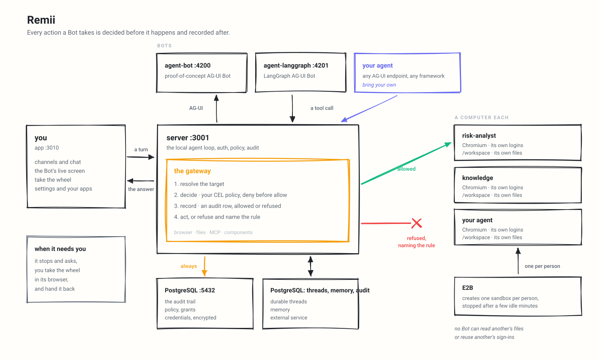

<div align="center">

# Remii

**An AI assistant your company can actually own.** Same shape as ChatGPT, Claude or Grok, with one difference that matters: it runs on your infrastructure and you can change anything about it. Any agent stack, through AG-UI.

Each coworker gets a computer of its own: a real browser with its own logins, its own files, and only the tools you grant. Every action decided before it happens and recorded after.

[**Quick start**](#quick-start) · [**Docs**](docs/README.md) · [**Configuration**](docs/configuration.md) · [**Architecture**](docs/architecture.md)

[](https://github.com/harshjorwal7/Remii/actions/workflows/ci.yml)
[](https://github.com/harshjorwal7/Remii/actions/workflows/security_zizmor.yml)
[](./LICENSE)


</div>

<div align="center">

Bring any AG-UI agent, written on a framework or by hand, and it arrives as a
coworker with a channel of its own. Watch it work on its own screen, take the
wheel when it reaches something it should not do alone, then hand it back. It
answers with components rather than only prose, and the whole thing runs on
your own machine.

</div>

> **Run it yourself.** Remii is meant to be cloned and made your own: you take the repository, replace the example tenant package under `examples/` with your own coworkers, channels and skills, and run it. Nothing in it phones home — the only outbound traffic is to the model provider, your E2B account, and whichever integrations you turn on.

> **Under active development.** Remii is pre-1.0 and moves fast. Expect rough edges, and expect them to change without a migration path. Run it on your own machine before you depend on it.

> **Runs on your machine.** Everything below is written for a laptop. `.env.example` carries `REMII_SINGLE_USER=true`, which admits every request as one local user, so a fresh clone reaches the product without registering an OAuth client first. [Sign-in](#sign-in) turns that off, and is required before anybody else can reach the deployment.

## What it is

An agent platform that runs inside your own infrastructure. Docker Compose brings up every part of it, the data sits in your PostgreSQL, and the model is yours to choose: no model ships in the box, and each person supplies their own credentials, which are encrypted at rest and never logged.

Two example tenant packages ship, and which one loads is set by `TENANT_PACKAGE_DIR` — `../examples/consumer` by default. It declares one coworker and six files in `examples/consumer/agents/`, each one a single job: web research, reading a receipt, pulling the follow-ups actually in a meeting note, data analysis, job applications, and curating social posts. `examples/fintech` is the other one, and it is the larger: `Remii` (Chief of Staff) and `Knowledge` for everyday work and company questions, a `Risk Analyst` reached as an endpoint, and eleven files in `examples/fintech/agents/`. Coworkers are configuration rather than code — add your own by dropping a file in that directory, by editing `agents.yaml`, or from `/agents` in the UI.

Anything a Bot does to a computer, a file, an MCP server or a component goes through one gateway that decides and records it. That is the difference between an agent that can use your tools and an agent you can let near them.

## Built on AG-UI

A Bot is any endpoint speaking [AG-UI](https://github.com/ag-ui-protocol/ag-ui), the open protocol for agent-to-user interaction, so Remii is not tied to a framework and neither are you. Agents built with LangGraph, Mastra, CrewAI, Pydantic AI, Google ADK or written by hand all arrive the same way, and the governance rides the protocol rather than the framework.

<picture>
  <source media="(prefers-color-scheme: dark)" srcset="assets/architecture-dark.svg">
  
</picture>

## Requirements

- Docker, for PostgreSQL and the shipped Bots.
- [Bun](https://bun.sh) 1.3+, for the app and API server.
- A model key. The built-in Remii loop runs on `DEEPSEEK_API_KEY` and nothing else — one provider,
  one model (`deepseek-flash`), no fallback chain. The shipped AG-UI Bots each take their own key and
  between them cover OpenAI, Anthropic, Google, DeepSeek and local OpenAI-compatible endpoints; see
  [docs/configuration.md](docs/configuration.md).

## Quick start

> **Setting up with an AI assistant?** Paste [`prompt.txt`](prompt.txt) into it first. It carries the
> same steps as below plus the things that are easy to get wrong: which of the blank keys in
> `.env.example` are yours to fill and which the start script generates for you, and what each
> start-up refusal means. Every claim in it is checked against this repository.

1. Create `.env`:

   ```sh
   cp .env.example .env
   ```

2. Fill in a model key. The built-in Remii loop needs exactly one:

   - `DEEPSEEK_API_KEY` — commented out in `.env.example` at line 403; uncomment it
   - `OPENAI_API_KEY` — instead, if you are running a shipped AG-UI Bot rather than the built-in loop

   Threads, messages, runs and locks live in this deployment's own
   PostgreSQL — there is no cloud service to sign up for and no key to fetch.
   The example `KEY_ENCRYPTION_KEY` is public and fine locally; generate your own with:

   ```sh
   openssl rand -base64 32
   ```

3. Install and run:
   ```sh
   bun install
   bash scripts/start.sh
   ```

4. Open <http://localhost:3010>.

`scripts/start.sh` starts Docker services, applies migrations, starts the API server on port 3001, starts the app on port 3010, and checks that the services answer their own health routes before printing next steps.

`scripts/stop.sh` takes the same things down, including each Bot's computer, which compose does not own. Nothing is deleted: the database, the Bots' files and their browser profiles are volumes.

## Deploy it

One image carries the app, the API, the browser the Bots drive, and optionally PostgreSQL. Same
`.env`, no Kubernetes.

```sh
# The published image. Nothing to clone and nothing to build.
docker run -p 3001:3001 --env-file .env \
  -e EMBEDDED_POSTGRES=on -v remii-data:/var/lib/postgresql \
  ghcr.io/harshjorwal7/remii:latest

# Or the tree you have in front of you.
docker build -t remii .
docker run -p 3001:3001 --env-file .env \
  -e EMBEDDED_POSTGRES=on -v remii-data:/var/lib/postgresql remii
```

Everything is on 3001 here, the app included, rather than the 3010 the clone uses. `latest` is the
most recent release and a version tag such as `:v0.0.13` pins one.

Leave `EMBEDDED_POSTGRES` off and set `DATABASE_URL` to point at a database you already run.
[docs/deployment.md](docs/deployment.md) has the minimum sizes, the platform notes, and how it behaves behind more than one replica.

## Try it

- Open `/bot` and ask: `Open news.ycombinator.com and tell me the top story.`
- Ask the Bot to fill out <https://httpbin.org/forms/post>, then review what it ran beside its screen.
- Open `/settings/boundaries`, add a deny rule or preset, and retry the same browser action.
- Create a coworker from `/agents`, give it a standing role, and start a channel with it.

## Main surfaces

| Route                          | Purpose                                                            |
| ------------------------------ | ------------------------------------------------------------------ |
| `/`                            | Start and browse channels.                                         |
| `/agents`                      | Create, edit, duplicate, hide, delete, and launch coworkers.       |
| `/channel/:id`                 | Converse with one coworker, watch its screen, and see what it ran. |
| `/channel/new`                 | Start a channel with a coworker you already have.                  |
| `/bot`                         | Direct chat with a Bot; `?agent=<id>` selects one.                 |
| `/skills`                      | Create and enable personal skills, and point them at a repo.      |
| `/routines`                    | See the routines that are standing, and stop one.                  |
| `/apps`                        | The apps your Bots may read, as you.                               |
| `/settings`                    | User preferences.                                                  |
| `/settings/boundaries`         | Your own browser/file/MCP action policy.                           |
| `/settings/connected-accounts` | Connect your own accounts, and add apps from a broker's directory. |
| `/settings/components-gallery` | What your Bots can draw in a conversation.                         |
| `/settings/memory`             | What Remii remembers about you, and what it has forgotten.         |
| `/settings/schedules`          | The scheduled turns standing jobs report into.                     |
| `/settings/tasks`              | Filed tasks, and the triage queue behind them.                     |
| `/settings/files`              | Files Bots have saved for you.                                     |
| `/settings/computer`           | The sandbox: create it, watch it, stop it.                         |
| `/settings/telegram`           | Link Telegram, so a Bot can reach you there.                       |
| `/settings/vault`              | Your own logins, cards and personal details.                       |
| `/settings/billing`            | Plan, credits and usage — yours alone.                             |

Every settings page shows one person's own data. There are no administrators,
no user list, and no shared screens: each user is sovereign over their own
coworkers, computers, connections and history.

## Features

- **A computer per person**: each person gets one E2B sandbox with its own desktop, browser, logins and `/workspace`, created the first time they need it and stopped after a few idle minutes. Bots belonging to that person share it, arbitrated so two never move the mouse at once.
- **A shell, not just a browser**: a Bot can run a command in its workspace, install what it needs, and process a file it saved. Through the same gate as everything else, so a rule can refuse a shell outright or refuse particular commands, and the command is on the record either way. The command inherits PATH, locale, terminal and proxy variables, not the rest of the deployment's environment.
- **The gateway is the only way in**: it resolves the target from a server-held snapshot, evaluates the policy, writes the audit row, and only then calls the computer. There is no path that acts without the record existing first.
- **CEL policy, fail closed**: rules can inspect `tool.name`, `intent`, `bot.id`, `actor.id`, `page.url`, `page.host`, `element.*`, `key`, `command`, `file.*`, `mcp.*` and `initiator.*` (what started the run, so a rule can refuse a scheduled routine what it would allow a person). Deny is evaluated before allow, a missing policy permits nothing, and a broken rule refuses rather than opens.
- **Watch what it is doing**: the screen shows what a Bot is looking at, and the Activity tab beside it shows what it ran, read and saved, with the output. A command line in the transcript opens to the same thing. A saved file shows its path and size, never its contents.
- **Take the wheel**: a Bot that hits a login wall or a 2FA prompt asks for help. Control is handed over in the same panel and recorded as `computer.help_requested`, `computer.control_taken` and `computer.control_released`. While a person is driving, Bot actions are refused rather than queued.
- **Secrets never enter the transcript**: the trail records that a secret was requested and how long it was, not what it said.
- **Bring your own agent**: any AG-UI endpoint is a Bot, on a framework or hand-written. Endpoints are validated with the same target checks used for browser navigation, and an auth header is stored write-only.
- **Components instead of prose**: compiled React components live in `app/src/components/gallery/`, and a Bot may also draw an interface it wrote itself, rendered in a sandboxed iframe. Both appear in the Components gallery under Settings. Every call asks the server whether the component exists, is published, and is not withheld from that Bot. Data functions are granted per component.
- **Governed MCP**: Google Drive and Notion ship in the catalogue, and Composio brokers a few hundred more apps behind one key, each reached as the person asking. You add the apps you want under Settings → App connections, and consent to each one with your own account. The catalogue carries only vendors this deployment stands behind, so adding one is a review of that vendor. Custom servers must pass URL checks; unknown tools and custom-server tools are treated as writes, and a catalogue tool the server advertises but does not name as a write classifies as a read. A Bot is told which connectors exist here and which it holds, so it says it has not been granted one rather than browsing to the vendor's website.
- **Skills are instructions, not capabilities**: a skill attaches only to Bots you own, and both personal skills and the ones the example package ships are invoked with `/` in the composer. A Bot granted the shipped `skill-creator` skill can write one with you in the conversation, and saves it only when you press the button on the card.
- **A skill can point at a public repository**: give it a GitHub address and a Bot holding that skill gets three tools to read that one repository — an overview, a search, and one file at a time. Nothing else becomes reachable, and the grant of the skill is the gate rather than the address. Public only, by design: it is content, not a capability, and a credential would stop it being either.
- **Sign in with what your company already has**: Google, Microsoft or Okta from the environment. Any one turns sign-in on; several may be configured at once.
- **An audit trail you can read**: every action a Bot takes, and every refusal, writes a row before the action happens. The Activity tab beside a Bot's screen shows what it ran, and the boundary dry run at `/settings/boundaries` replays your own recent decisions so a new rule says what it would have changed before you save it.
- **Credentials encrypted at rest**: stored through the Vault under Settings, never returned by an API, and redacted from audit events.
- **A computer is not a port you can reach**: it is an E2B sandbox driven through E2B's own API, holding a browser with real logins. The API key is server-side and never reaches the browser, so nothing reaches a logged-in desktop by guessing an address.
- **Durable threads**: conversations survive restarts in PostgreSQL, and each deployment stamps the threads it owns.
- **It remembers, and shows you**: durable facts are extracted from a conversation, stored with both a vector and the full text, and only recalled when a recall gate decides the question actually needs them. `/settings/memory` lists every fact it holds and lets you delete one, and a nightly consolidation merges duplicates and resolves contradictions — so what it remembers is something you have read rather than something it inferred silently.
- **It reaches you where you are**: a Telegram Bot answers as the same coworker, receiving text, voice notes and photos, and sends its turn back into the thread it belongs to. Linked once under `/settings/telegram`, with the token and username travelling together because one without the other is a link to nowhere.
- **Scheduled turns and a task queue**: `/settings/schedules` runs a prompt on a cron expression and files the answer where you asked for it, and `/settings/tasks` is where filed work and model-triaged follow-ups land, so nothing a Bot noticed is lost because there was no channel open at the time.
- **Files Bots keep for you**: anything a Bot writes to `/workspace` or saves through a tool is listed under `/settings/files` with its path and size. Contents are never served from the audit trail, only from the file itself.
- **Routines**: ask a Bot to do something on a schedule and it does, running as you, in the channel you asked in. A 15-minute floor and a cap of 20 enabled routines keep a sentence from scheduling more than a person meant, and ten failures in a row switch a routine off rather than burn model spend forever. Needs a worker process; see [docs/routines.md](docs/routines.md).

## Bring your own agent

Any AG-UI endpoint can be a Bot.

From `/agents`, create a coworker with:

- name, title, and role description;
- optional AG-UI endpoint;
- optional write-only authorization header.

Every coworker is private to its owner: there is no public tier, and nobody
may use, see, or run a coworker that is not theirs. Deployment templates are
shared definitions only — the moment a user starts one, they get their own
private copy with their own sandbox, workspace and connections, so one user's
data never mixes with another's.

The server validates agent endpoints with the same target checks used for browser navigation, at registration and again on every redirect the endpoint answers with. If no custom endpoint is set, product-created coworkers use `MANAGED_AGENT_AG_UI_URL` when it is configured, and are refused when it is not.

A private address is refused unless it is listed in `AGENT_ENDPOINT_ALLOWED_HOSTS`:

```sh
AGENT_ENDPOINT_ALLOWED_HOSTS=agents.internal,10.0.0.42:9000
```

A host on its own covers any port on that host; a host with a port pins that port. Matching is exact: no wildcards, no suffixes. An entry written as a URL, or containing `*`, stops startup and names that entry.

The list covers agent endpoints only. Browsing is unaffected, the addresses holding a deployment's own cloud credentials are refused whatever is listed, and listing an address permits registering an agent there rather than granting that agent anything.

Tenant package agents are declared in `agents.yaml` as either:

- `built-in`, with a system prompt; or
- `remote-ag-ui`, with an endpoint.

See [docs/configuration.md](docs/configuration.md) and [docs/coworkers.md](docs/coworkers.md).

## Configuration

`.env.example` is the source template. The API server refuses to start without:

- `DATABASE_URL`
- `KEY_ENCRYPTION_KEY`

Settings worth knowing:

| Variable                             | Use                                                                       |
| ------------------------------------ | ------------------------------------------------------------------------- |
| `REMII_SINGLE_USER`                | Admits every request as one local user. Required when no identity provider is configured; `.env.example` ships it on. |
| `OPENAI_BASE_URL`                    | Answers the OpenAI-shaped calls from somewhere else: a gateway, a proxy.  |
| `ANTHROPIC_BASE_URL`, `GOOGLE_GENERATIVE_AI_BASE_URL` | The same, for those two APIs.            |
| `COMPUTER_TOKEN`                     | Secret every E2B sandbox receives as its service secret. Required — the server refuses to boot without it. `start.sh` sets one. |
| `AGENT_TOOL_TOKEN`                   | Secret a Bot presents to call a granted tool back. `start.sh` sets one. Without it no Bot may call tools. |
| `EMBEDDED_POSTGRES`                  | Set to `on` for a database inside the deployment container.               |
| `AGENT_COMPUTER_POLICY`              | JSON action policy. Malformed JSON stops server startup.                  |
| `AGENT_COMPUTER_ALLOW_PRIVATE_HOSTS` | Lets a Bot reach this machine's own services. Local only, and refused under `NODE_ENV=production`. |
| `AGENT_ENDPOINT_ALLOWED_HOSTS`       | Private addresses an agent may be registered at, comma separated. A host, optionally with a port. |
| `TENANT_PACKAGE_DIR`                 | Directory containing tenant YAML. Defaults to `../examples/consumer`.      |
| `DEPLOYMENT_ID`                      | Names this deployment when two share one database.                                    |

Full reference: [docs/configuration.md](docs/configuration.md).

## Architecture

| Service                  | Port                       | Purpose                                                                                          |
| ------------------------ | -------------------------- | ------------------------------------------------------------------------------------------------ |
| `app`                    | 3010                       | React/Vite UI.                                                                                   |
| `server`                 | 3001                       | Hono API: the local agent runtime, auth, policy, audit, plugins, components, coworkers, and channels. |
| `agent-bot`              | 4200                       | Proof-of-concept AG-UI Bot.                                                                          |
| `agent-langgraph`        | 4201                       | LangGraph AG-UI Bot.                                                                             |
| `worker`                 | — (on demand)              | The out-of-band worker: memory consolidation, schedules, and Telegram delivery.                  |
| PostgreSQL with pgvector | 5432 | Product data, policy, audit, credentials, grants, channels, threads, and component metadata. |
| A person's computer      | — (over the E2B API)   | One E2B sandbox each: XFCE, Chromium, `/workspace`, reached through E2B's Computer Use and process APIs. |

Durable threads, messages, runs and locks all live in PostgreSQL — there is no external service to configure.

The server gateway is the product/API path for Bot browser and file tool calls.
It resolves the target, evaluates policy, writes an audit row, and only then calls the
computer. The E2B sandbox also exposes lower-level service endpoints of its own; keep
them private and do not use them to bypass the gateway.

More detail: [docs/architecture.md](docs/architecture.md).

## Sign in

`.env.example` ships `REMII_SINGLE_USER=true`, which is one local user and no sign-in: how a
fresh clone reaches the product without registering an OAuth client first. Delete that line and
configure **any one** of Google, Microsoft or Okta before anybody else can reach the deployment.
With neither, it refuses to start rather than admitting every visitor as a user of their own.
Configure more than one provider and the sign-in screen offers each of them.

These three are needed whichever you pick:

```sh
BETTER_AUTH_URL=http://localhost:3001        # where OAuth callbacks come back to
BETTER_AUTH_SECRET=                          # openssl rand -base64 32
TRUSTED_ORIGINS=http://localhost:3010        # where the app is served from
```

Then the provider. Register the redirect URI shown beside it.

```sh
# Google — http://localhost:3001/api/auth/callback/google
GOOGLE_OAUTH_CLIENT_ID=
GOOGLE_OAUTH_CLIENT_SECRET=

# Microsoft — http://localhost:3001/api/auth/callback/microsoft
MICROSOFT_OAUTH_CLIENT_ID=
MICROSOFT_OAUTH_CLIENT_SECRET=
MICROSOFT_OAUTH_TENANT_ID=common             # your directory GUID for staff only

# Okta — http://localhost:3001/api/auth/callback/okta
OKTA_OAUTH_CLIENT_ID=
OKTA_OAUTH_CLIENT_SECRET=
OKTA_OAUTH_ISSUER=https://example.okta.com/oauth2/default
```

Restart. Accounts and sessions are stored in the same PostgreSQL database as everything else.

Every account that can authenticate through one of these providers may sign in, and each one sees
only its own data. There is no role to assign and no screen that could grant one over somebody else,
so a sign-in is never refused for being the wrong person.

- `MICROSOFT_OAUTH_TENANT_ID` defaults to `common`, which admits personal Microsoft accounts as well
  as work ones. On a multi-tenant app registration Entra may send no `email` claim at all, so
  Remii falls back to `upn` and then `preferred_username`. If none of the three arrives the
  sign-in is refused and the reason is logged: add `email` as an optional claim, or use your
  directory GUID here.
- A half-configured provider is refused at start-up rather than at somebody's first attempt to sign
  in: a client id with no secret, a secret shorter than 32 characters, or an Okta issuer with no
  credentials behind it.
- **SAML and OpenID Connect are not configurable at runtime.** Those three routes are closed, so a
  signed-in user cannot register a provider for a domain and mint themselves colleagues out of one.
  A deployment that needs company SSO puts it in front of Remii rather than inside it.
- **Put TLS in front of any deployment.** A page served over plain `http://` on anything but
  localhost is not a secure context, and sign-in cookies want `Secure`.

## Keeping it to your machine

- A E2B sandbox drives a browser holding real logins. The `E2B_API_KEY` is server-side and never reaches the browser, so keep it that way.
- Store credentials in the Vault under Settings, which encrypts them. Do not put credential values in tenant YAML or in committed files.
- `AGENT_COMPUTER_ALLOW_PRIVATE_HOSTS` lets a Bot reach services on this machine. It ships commented out in `.env.example`, is for a laptop only, and a deployment running with `NODE_ENV=production` refuses to start while it is set.
- To reach an agent on your own network from a deployment, list its address in `AGENT_ENDPOINT_ALLOWED_HOSTS` instead. That permits the one address, where the switch above permits the network.

## Development

```sh
bun run format:check
bun run lint
bun run typecheck
bun run test
bun run build
```

After changing the Drizzle schema:

```sh
bun run --filter server db:generate
bun run --filter server db:migrate
```

Use `bash scripts/start.sh` for the whole stack and `bash scripts/stop.sh` to take it down. Use `bun run dev` only when you want the app and server without the Docker Bots and computers.

## Documentation

- [docs/README.md](docs/README.md)
- [docs/architecture.md](docs/architecture.md)
- [docs/configuration.md](docs/configuration.md)
- [docs/development.md](docs/development.md)
- [docs/coworkers.md](docs/coworkers.md)
- [docs/deployment.md](docs/deployment.md)
- [docs/releasing.md](docs/releasing.md)

## Contributing

- Open an issue or coordinate before starting substantial work.
- Keep changes focused and update docs when setup, configuration, architecture, or user behavior changes.
- Keep secrets, service-account JSON, customer data, and local transcripts out of the repository.
- Run the checks in [Development](#development) before opening a pull request.

## License

[MIT](./LICENSE) © harshjorwal7
